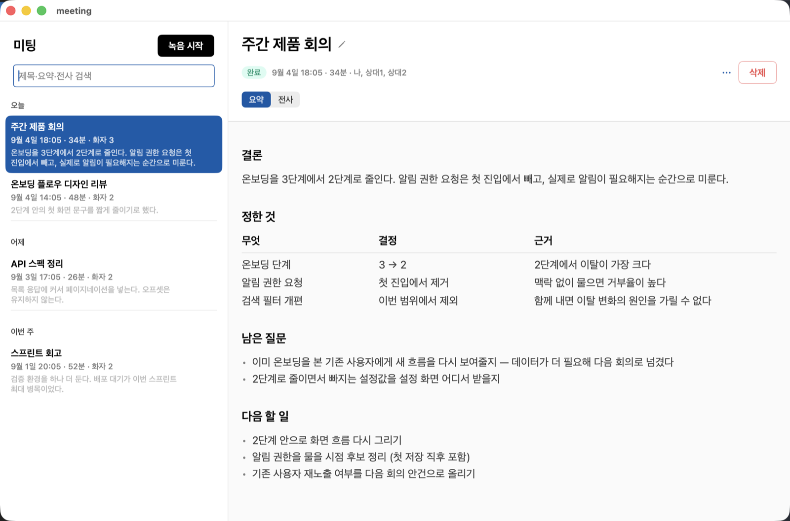
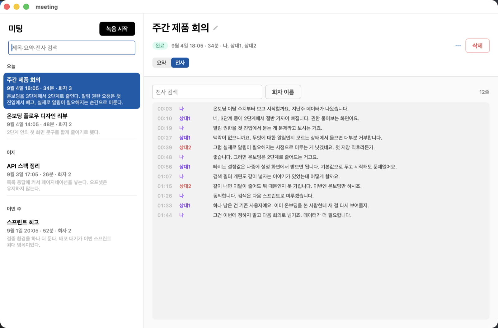
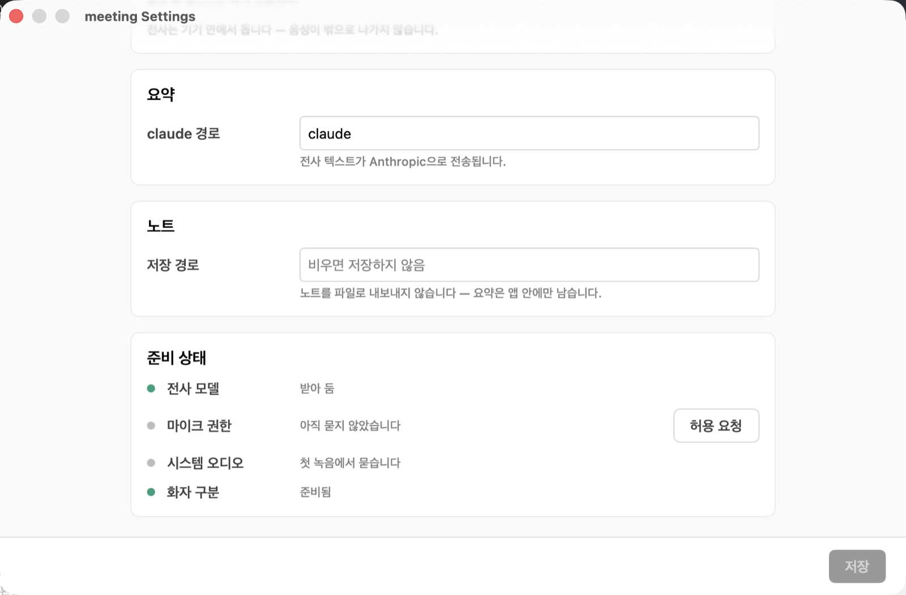

# meeting

macOS 미팅 녹음기 — 마이크와 시스템 오디오를 같이 받아 **기기 안에서** 전사하고, 요약해서 마크다운 노트로 내보낸다.

> **English**: A macOS meeting recorder. It captures the microphone and system audio together,
> transcribes locally with WhisperKit, and optionally summarizes via the `claude` CLI.
> The app UI, prompts, and code comments are Korean-only for now.



화면에 보이는 회의 내용은 전부 예시로 지어낸 것이다.

## 데이터가 어디로 가나

읽고 시작해야 하는 부분이다.

| 단계 | 어디서 도나 | 밖으로 나가나 |
|---|---|---|
| 녹음 | Core Audio 프로세스 탭 + 마이크 | 나가지 않음 (`~/Library/Application Support/meeting/recordings`) |
| 전사 | WhisperKit, 기기 내 추론 | 나가지 않음 (모델은 최초 1회 Hugging Face에서 내려받는다) |
| 화자 분리 | sherpa-onnx, 로컬 venv | 나가지 않음 (모델은 최초 1회 GitHub 릴리즈에서 내려받는다) |
| 요약 | 로컬 `claude` CLI에 전사를 넘긴다 | **전사 텍스트가 Anthropic으로 전송된다** |
| 노트 저장 | 지정한 디렉토리에 마크다운 | 나가지 않음 |

요약은 선택이다. 설정에서 `claude 실행 파일`을 비우면 녹음·전사까지만 하고 요약 단계를 건너뛴다 — 그래도 미팅은 정상 완료된다.

**녹음 전에**: 이 앱은 상대방의 목소리를 함께 기록한다. 통화·회의 녹음은 지역에 따라 참여자 전원 또는 일방의 동의를 요구한다. 동의를 얻는 것은 쓰는 사람의 몫이다.

## 필요한 것

- macOS 15 이상 (Core Audio 프로세스 탭 API)
- Swift 6.0 이상 툴체인 — Xcode 또는 Command Line Tools
- 권한 3종: 마이크 · 시스템 오디오 녹음 · (통화 창 제목으로 이름을 짓게 하려면) 화면 기록
- 선택: [`claude` CLI](https://claude.com/claude-code) — 요약용. 없으면 요약만 빠진다
- 선택: Python 3.10+ — 화자 분리용. 없으면 화자 라벨 없이 전사만 나온다

첫 전사에서 WhisperKit large-v3 모델(약 626MB)을 내려받는다. 설정 화면의 `[모델 준비]`로 미리 받아 둘 수 있다.

## 설치

```sh
git clone https://github.com/ParkJin0318/meeting.git
cd meeting
scripts/package-app.sh          # dist/meeting.app 을 조립한다
open dist/meeting.app
```

`/Applications`에 놓고 쓰려면 `scripts/deploy.sh`가 종료·교체·재실행까지 한다.

재설치할 때마다 권한을 다시 허용하는 게 번거로우면 `scripts/make-signing-identity.sh`로 로컬 코드서명 인증서를 한 번 만들어 둔다(자체 서명 — 배포용이 아니다).

화자 분리를 쓰려면:

```sh
scripts/setup-diarization.sh    # venv + sherpa-onnx + 모델(pyannote segmentation, 3D-Speaker)
```

## 개발

```sh
swift build && scripts/test.sh
```

`scripts/test.sh`는 Xcode가 있으면 `swift test`에 위임하고, Command Line Tools만 있는 머신에서는 swift-testing이 필요로 하는 프레임워크 경로를 채워 준다.

## 화면

전사 탭은 시각·화자·문장을 한 줄에 놓는다. 화자 라벨은 트랙(마이크 = 나, 시스템 = 상대)과 화자 분리에서 나오고, `[화자 이름]`으로 실제 이름을 붙이면 요약과 노트까지 따라간다. 줄을 누르면 그 시점부터 재생한다.



설정은 파이프라인 순서다 — 녹음 → 전사 → 요약 → 노트. 맨 아래 `준비 상태`가 전사 모델·마이크 권한·시스템 오디오·화자 구분을 한자리에서 보여 준다. 요약과 노트 저장은 비워 두면 그 단계를 건너뛰고, 미팅은 전사까지로 정상 완료된다.



## 라이브러리로 쓰기

단독 앱은 얇은 셸이고 파이프라인은 전부 라이브러리 타깃에 있다. 다른 macOS 앱이 미팅 화면을 그대로 임베드할 수 있다.

| 제품 | 내용 | 의존 |
|---|---|---|
| `MeetingCore` | 모델·녹음·전사·요약·노트 내보내기 | 시스템 프레임워크만 |
| `MeetingWhisper` | WhisperKit 어댑터 | WhisperKit |
| `MinimalUI` | 디자인 토큰·컴포넌트·마크다운 뷰 | SwiftUI |
| `MeetingUI` | `MeetingSession` + 미팅 화면 | 위 셋 |

호스트가 채워야 하는 구멍은 넷이다: `MeetingStoring`(저장소) · `MeetingNotifying`(알림) · `MeetingSummarizing`(요약) · `MeetingSettings`(설정 값). 경로와 이름은 `MeetingHostProfile(appSupportName:)`에서 모두 유도되므로 패키지는 호스트가 누구인지 모른다.

```swift
.package(url: "https://github.com/ParkJin0318/meeting.git", from: "0.1.0")
```

## 노트 내보내기

기본은 꺼져 있다. 설정에서 경로를 넣으면 그 아래에 마크다운을 쓴다 — 요약 노트는 `wiki/notes/meetings/`, 전사 원문은 `raw/`, 변경 이력은 `wiki/log.md`. 경로 안에 `wiki/` 디렉토리가 있어야 vault로 인정한다.

vault 루트에 `wikimap.py`가 있으면 저장 후 실행해 색인을 갱신한다. 없으면 그냥 건너뛴다.

## 알려진 제약

- UI·요약 프롬프트·코드 주석이 전부 한국어다. 요약 **본문**의 언어는 설정의 전사 언어를 따라간다
- 요약은 `claude` CLI 한 가지만 지원한다. 다른 백엔드를 붙이려면 `MeetingSummarizing`을 구현해 꽂으면 된다
- 노트 내보내기가 기대하는 디렉토리 구조가 고정돼 있다(위 참조)

## 라이선스

[MIT](LICENSE).

의존성: [WhisperKit](https://github.com/argmaxinc/argmax-oss-swift) (MIT). 런타임에 내려받는 모델은 각자의 라이선스를 따른다 — Whisper large-v3 (MIT), pyannote segmentation 3.0 (MIT), 3D-Speaker ERes2Net (Apache-2.0).
